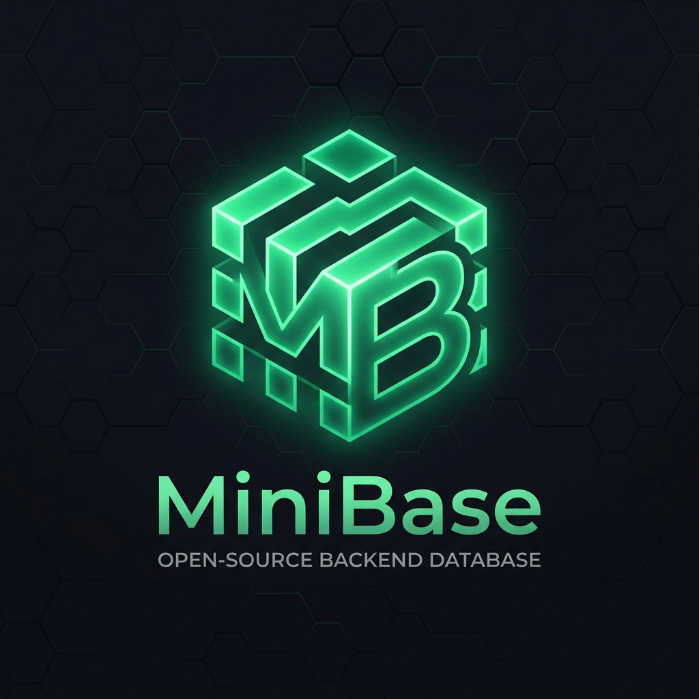

<div align="center">



# ⚡ MiniBase
### Ultra-Lightweight, Zero-Config Backend-as-a-Service (BaaS) with Embedded SQLite

[](https://nodejs.org/)
[](https://www.sqlite.org/)
[](https://github.com/kothalkarkkartik/MiniBase)
[](LICENSE)

An open-source, ultra-fast **PocketBase alternative** built natively with Node.js & SQLite (WAL Mode). Zero external database servers required. Memory footprint: **~35MB RAM**.

[🚀 Quick Start](#-quick-start-options) • [📖 How to Use](#-how-to-use-minibase-complete-guide) • [📱 Connect App & SDKs](#-connect-app--client-sdks) • [🌐 REST API](#-rest-api-cheatsheet) • [🐧 VPS CLI](#-vps-management-cli)

---

</div>

## ✨ Key Highlights

- 🚀 **Zero-Config Embedded SQLite**: Instant startup with WAL mode (`journal_mode=WAL`) for high concurrency and supersonic performance.
- 🎨 **PocketBase-Inspired Dark Studio**: Ultra-sleek, responsive DevTools dark dashboard with schema builder, records grid, live filters, and system logs.
- ✏️ **Inline Cell Editing (Excel/Notion Style)**: Double-click any table cell to edit numbers, text, or booleans inline with instant database autosave.
- 📥 **1-Click CSV / JSON Bulk Importer**: Drag-and-drop any `.csv` or `.json` file to auto-detect columns and bulk-insert thousands of rows in 1 second.
- 🔍 **Visual Filter Builder**: Build complex query filters visually (`[ Category ] [ is equal to ] [ Nature ]`) without syntax confusion.
- 📱 **Instant "Connect App" Code Generator**: Copy-paste live code snippets for **Flutter (Dart)**, **React / Next.js (JS)**, **Python**, and **cURL**.
- ⚡ **Realtime Subscriptions**: Built-in Server-Sent Events (SSE) live stream for instant push updates to mobile and web apps.
- 🔒 **User Authentication & Granular API Rules**: Password hashing with Scrypt, JWT auth, and customizable access rules per collection.
- 🌐 **Built-in Cloudflare Live Tunnel**: 1-click free public HTTPS URL (`--tunnel`) to test mobile and web apps worldwide with zero router/DNS config.
- 💾 **1-Click Database Disaster Recovery**: Full database export archive and instant drag-and-drop restore.

---

## 🚀 Quick Start Options

### Option 1: Linux / VPS 1-Command Auto Setup (Recommended for Servers) 🔥
Paste this single command into your Linux / VPS terminal:
```bash
curl -fsSL https://raw.githubusercontent.com/kothalkarkkartik/MiniBase/main/scripts/install.sh | bash
```
> **What this does automatically:**
> - Detects OS & installs Node.js 22 LTS if missing.
> - Clones MiniBase & installs production dependencies.
> - Creates a **24/7 background system service (`systemd`)** with auto-restart on reboot.
> - Configures the universal global **`minibase`** CLI command.
> - Displays your Admin Studio URL and credentials.

---

### Option 2: Windows Native Desktop App 💻
Simply double-click:
```
MiniBase-Studio.exe
```
> Launches a dedicated, standalone **Native Desktop Software Window** with custom icon, zero black console flickers, and automatic background server management!

---

### Option 3: Manual Git / Local Setup
```bash
# 1. Clone repository
git clone https://github.com/kothalkarkkartik/MiniBase.git
cd MiniBase

# 2. Install dependencies
npm install

# 3. Start MiniBase Studio
node bin/minibase.js serve --open
```

---

### Option 4: Docker & Docker Compose 🐳
```bash
docker compose up -d
```
Access Admin Studio at `http://localhost:8090/_/` (data persists in `./minibase_data`).

---

## 📖 How to Use MiniBase (Complete Guide)

### 1. Initial Admin Login
Open your browser and navigate to:
```
http://localhost:8090/_/
```
*(On a VPS, replace `localhost` with your VPS IP, e.g. `http://192.168.1.100:8090/_/`)*

- **Default Email**: `admin@minibase.io`
- **Default Password**: `admin12345`
*(You can change your password anytime in Settings)*

---

### 2. Creating Collections & Custom Schema
1. Click **`+ New Collection`** in the left sidebar.
2. Enter collection name (e.g. `products`, `wallpapers`, `posts`).
3. Choose Collection Type:
   - **Base Collection**: Standard data table.
   - **Auth Collection**: User accounts table with authentication, email, and password hashing.
4. Add Fields with custom types:
   - `text`, `number`, `bool`, `email`, `url`, `json`, `file`, `relation`, `select`.
5. Set API Access Rules (e.g. Leave blank for Public, or `@request.auth.id != ""` for Authenticated Users).
6. Click **Create Collection** — your SQLite table is created instantly!

---

### 3. Inline Cell Editing (Excel / Notion Style)
- Double-click any text or number cell in the table to edit inline.
- Toggle booleans directly with a single click.
- Press **Enter** to save, or **Escape** to cancel.

---

### 4. Bulk CSV / JSON Import
1. In any collection view, click the **`Import`** button.
2. Drag and drop your `.csv` or `.json` file.
3. MiniBase will preview the rows and map fields automatically.
4. Click **Import Records** — all rows are batch-inserted in milliseconds!

---

### 5. Visual Filter Builder
1. Click the **`Filter Builder`** icon next to the search bar.
2. Add condition chips: `[ Field ] [ Operator (=, !=, >, <, contains) ] [ Value ]`.
3. Combine rules with `AND` / `OR` logic.
4. The table filters immediately without having to write raw SQL.

---

### 6. 1-Click "Connect App" Code Generator
1. Click the green **`Connect App`** button in the topbar or table header.
2. Select your platform:
   - 📱 **Flutter / Dart**
   - ⚛️ **JavaScript / React / Next.js**
   - 🐍 **Python**
   - 🌐 **cURL / Postman**
3. Copy-paste the ready-to-run snippet directly into your frontend project!

---

### 7. Realtime Live Feed & SSE Subscriptions
- Click **Live Activity Feed** in the sidebar to monitor all live database inserts, updates, and deletes in real time.
- Subscribe programmatically in your app using Server-Sent Events (SSE).

---

### 8. Worldwide Public Live Tunnel
Want to test your mobile app or webhook without configuring router port-forwarding or SSL?
```bash
node bin/minibase.js serve --tunnel
```
MiniBase will instantly spin up a **Cloudflare Edge SSL Tunnel** with a worldwide HTTPS URL:
```
🌍 MiniBase is LIVE Worldwide:
➜ Mobile / Flutter API: https://random-name.trycloudflare.com
➜ Admin Studio:        https://random-name.trycloudflare.com/_/
```

---

### 9. Database Backup & Disaster Recovery
- **Download Hot Backup**: Navigate to **Settings** ➜ Click **Download DB Backup** (or `GET /api/admins/backup/export`).
- **Restore Backup**: Drag and drop any `.json` or `.db` backup file to restore all collections and rows instantly.

---

## 📱 Connect App & Client SDKs

### 1. Flutter (Dart SDK)
```dart
import 'dart:convert';
import 'package:http/http.dart' as http;

class MiniBaseService {
  static const String baseUrl = 'http://localhost:8090'; // or your Cloudflare Tunnel URL

  // Fetch records
  static Future<List<dynamic>> getRecords(String collection) async {
    final res = await http.get(Uri.parse('$baseUrl/api/collections/$collection/records?sort=-created'));
    if (res.statusCode == 200) {
      return jsonDecode(res.body)['items'];
    }
    throw Exception('Failed to load records');
  }

  // Insert record
  static Future<Map<String, dynamic>> createRecord(String collection, Map<String, dynamic> data) async {
    final res = await http.post(
      Uri.parse('$baseUrl/api/collections/$collection/records'),
      headers: {'Content-Type': 'application/json'},
      body: jsonEncode(data),
    );
    return jsonDecode(res.body);
  }
}
```

---

### 2. JavaScript / React / Next.js
```javascript
const BASE_URL = 'http://localhost:8090';

// 1. Fetch Records
async function getWallpapers() {
  const res = await fetch(`${BASE_URL}/api/collections/wallpapers/records?sort=-created`);
  const data = await res.json();
  return data.items;
}

// 2. Create Record
async function createWallpaper(payload) {
  const res = await fetch(`${BASE_URL}/api/collections/wallpapers/records`, {
    method: 'POST',
    headers: { 'Content-Type': 'application/json' },
    body: JSON.stringify(payload),
  });
  return res.json();
}

// 3. Live Realtime Push Updates
const sse = new EventSource(`${BASE_URL}/api/realtime`);
sse.onmessage = (event) => {
  const { action, record, collection } = JSON.parse(event.data);
  console.log(`[Realtime] ${action} on ${collection}:`, record);
};
```

---

### 3. Python Client
```python
import requests

BASE_URL = "http://localhost:8090"

# Fetch records
res = requests.get(f"{BASE_URL}/api/collections/wallpapers/records?sort=-created")
data = res.json()
print("Records:", data.get("items", []))

# Insert record
payload = {
    "title": "Neon Sunset",
    "category": "nature",
    "downloads": 120,
    "isFeatured": True
}
post_res = requests.post(f"{BASE_URL}/api/collections/wallpapers/records", json=payload)
print("Created Record:", post_res.json())
```

---

### 4. cURL
```bash
# 1. Fetch records
curl -X GET "http://localhost:8090/api/collections/wallpapers/records?page=1&perPage=20"

# 2. Insert record
curl -X POST "http://localhost:8090/api/collections/wallpapers/records" \
     -H "Content-Type: application/json" \
     -d '{"title":"Cyberpunk City","category":"urban","isFeatured":true}'
```

---

## 🌐 REST API Cheatsheet

| Endpoint | Method | Description |
| :--- | :---: | :--- |
| `/api/collections` | `GET` | List all collections |
| `/api/collections` | `POST` | Create a new collection schema |
| `/api/collections/:col/records` | `GET` | List paginated records (`?page=1&perPage=30&sort=-created&filter=...`) |
| `/api/collections/:col/records/:id` | `GET` | Get single record by ID |
| `/api/collections/:col/records` | `POST` | Create a new record |
| `/api/collections/:col/records/:id` | `PATCH` | Update a record |
| `/api/collections/:col/records/:id` | `DELETE` | Delete a record |
| `/api/batch` | `POST` | Execute atomic batch operations (inserts, updates, deletes) |
| `/api/admins/auth-with-password` | `POST` | Admin authentication & JWT token generation |
| `/api/collections/:authCol/auth-with-password` | `POST` | User login authentication |
| `/api/files/:col/:id/:filename` | `GET` | Serve stored files & auto-generated thumbnails |
| `/api/realtime` | `GET` | Server-Sent Events (SSE) live activity stream |
| `/api/admins/backup/export` | `GET` | Download full database JSON archive |
| `/api/admins/backup/restore` | `POST` | Restore database archive |

---

## 🐧 VPS Management CLI

Once installed on your Linux / VPS, manage MiniBase from anywhere in your terminal:

```bash
# Check service status, live URL, and credentials
minibase status

# View real-time database query & API logs
minibase logs

# Restart MiniBase service
minibase restart

# Stop MiniBase service
minibase stop

# Start MiniBase service
minibase start

# Create an instant SQLite hot backup
minibase backup ./my_backup.db
```

---

## ⚙️ Environment Configuration

| Variable | Default | Description |
| :--- | :---: | :--- |
| `PORT` | `8090` | HTTP Server port |
| `HOST` | `0.0.0.0` | Bind host address |
| `DATA_DIR` | `./minibase_data` | Directory for SQLite DB and uploaded media files |
| `JWT_SECRET` | auto-generated | Secret key for signing tokens |
| `NODE_ENV` | `production` | Environment mode (`development` / `production`) |
| `MINIBASE_TUNNEL` | `false` | Enable automatic Cloudflare Live Tunnel on startup |

---

## 📄 License

MiniBase is open-source software licensed under the [MIT License](LICENSE).
Built with ❤️ for developers who love speed, simplicity, and zero configuration.
